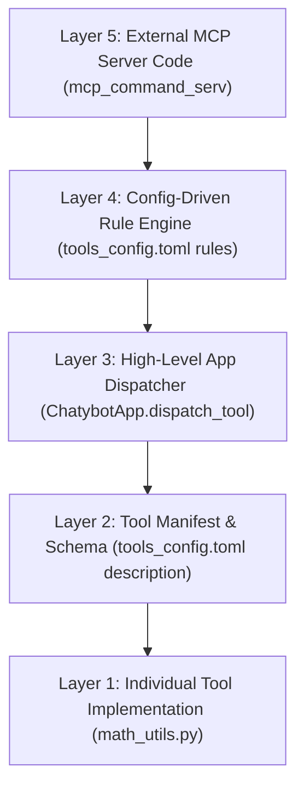

# Conditional Error Injection & Capability Error Guards in ChatyBot

## 1. Overview & Problem Statement

During agentic loop executions in ChatyBot, tool execution errors fall into two distinct categories:

1. **Permanent Capability Errors** (e.g. `McpError: Elicitation not supported`, `Method not found`):
   - **Root Cause**: The client environment or protocol handler does not support a feature requested by a tool/server.
   - **Behavior without guard**: The LLM treats the error as a temporary glitch and retries the exact same tool call repeatedly across turns, wasting tokens and causing rate-limit delays.
   - **Resolution**: Intercept capability error signatures at the high-level dispatcher, format explicit LLM guidance (`[PERMANENT CAPABILITY ERROR]`), and automatically disable the tool for the session (`self.tool_overrides[tool_name] = False`).

2. **Tool Usage & Syntax Errors** (e.g. Unsupported math functions in `calculate`):
   - **Root Cause**: The LLM attempts invalid parameters or functions (e.g. passing array lists `[3213, 681, ...]` or `average()` to scalar math evaluators).
   - **Behavior without hints**: The LLM guesses alternative syntax or constructs long, fragile hand-calculated arithmetic strings.
   - **Resolution**: Provide diagnostic guidance (`[TOOL USAGE HINT]`) suggesting valid syntax or alternative tools (such as `run_command` with Python).

---

## 2. Unconditional vs. Conditional Error Injection in `calculate`

### Current Implementation (Unconditional Hint Injection)

In [`src/chatybot/tools/math_utils.py`](file:///home/jon2allen/github2/chatybot/src/chatybot/tools/math_utils.py#L110-L150), hints are currently attached whenever `calculate` returns an error (either `result is None` or an `Exception` is caught):

```python
# Unconditional error hint injection in math_utils.py
hint_msg = (
    "\n\n[TOOL USAGE HINT]: Supported scalar operations: +, -, *, /, ^, sqrt, log, abs. "
    "For array/list statistics (mean, median, stddev, sum, min, max), use 'run_command' with Python."
)

if result is None:
    return {
        "status": "error",
        "message": f"Could not parse math expression '{expression}'.{hint_msg}",
        "result": None
    }

...

except Exception as e:
    return {
        "status": "error",
        "message": f"Error evaluating math expression '{expression}': {str(e)}.{hint_msg}",
        "result": None
    }
```

---

### Proposed Refinement: Conditional Hint Injection

To avoid appending math usage hints on unrelated errors (such as zero-division or variable lookup failures), the hint injection can be gated conditionally based on the error signature:

```python
# Conditional error hint injection
except Exception as e:
    err_str = str(e)
    # Only attach hint if the error relates to parsing, syntax, or unsupported terms
    if any(keyword in err_str.lower() for keyword in ["unsupported", "parse", "syntax", "invalid"]):
        hint_msg = (
            "\n\n[TOOL USAGE HINT]: Supported scalar operations: +, -, *, /, ^, sqrt, log, abs. "
            "For array/list statistics (mean, median, stddev, sum, min, max), use 'run_command' with Python."
        )
        err_str = f"{err_str}.{hint_msg}"

    return {
        "status": "error",
        "message": f"Error evaluating math expression '{expression}': {err_str}",
        "result": None
    }
```

---

## 3. High-Level App Interceptor vs. Lower-Level Tool Hints

### High-Level Interceptor (`src/chatybot/chatybot_app.py`)

At the `ChatybotApp` dispatcher layer, two helper functions manage error classification across all native and MCP tools:

1. **Capability Error Guard (`_is_permanent_capability_error` & `_format_capability_error`)**:
   - Detects `Elicitation not supported`, `Method not found`, etc.
   - Formats `[PERMANENT CAPABILITY ERROR]` message.
   - Auto-disables the tool via `self.tool_overrides[tool_name] = False`.

2. **Generic Tool Hint Interceptor (`_enrich_tool_error_with_hints`)**:
   - Inspects error responses from any tool (MCP or local).
   - Appends contextual `[TOOL USAGE HINT]` guidance based on error keywords.

---

## 4. Execution Trace Comparison

### Before (No Hint Guidance)
- **Turn 2**: Tried `average(...)` & `standard_deviation(...)` → Failed.
- **Turn 3**: Manually typed massive arithmetic string `(3213 + 681 + ...)/15`.
- **Turn 4**: Manually typed massive `sqrt(...)` string.
- **Turn 5**: Tried `median(...)` → Failed.
- **Turn 6**: Ran Python script for median.
- **Total Turns**: 6 turns with error-prone hand-written math formulas.

### After (With Accurate Hint Guidance & Auto-Disabling)
- **Turn 4**: Tried `calculate("3213, 681, ...")` → Failed with `[TOOL USAGE HINT]`.
- **Turn 5**: Read hint and executed `run_command` with Python `statistics` module → Returned Average, Median, and StdDev in **1 clean execution**.
- **Turn 6**: MCP `display_info` failed with `Elicitation not supported`.
- **Turn 7**: Second attempt at `display_info` was **instantly blocked by ChatyBot** (`Tool 'display_info' is currently disabled`).
- **Turn 8**: Model presented final answer directly.
- **Total Turns**: 5 turns with clean Python analytics and zero wasted MCP retries.

---

## 5. Architectural Layers for Error & Hint Injection

Error hint injection and capability handling can be implemented across 5 distinct architectural layers in ChatyBot, depending on control over tool code and configuration preferences:



---

### Layer Breakdown & Comparison

| Layer | Implementation Location | Scope | Modifies Code? | Suitable for Unmodifiable MCPs? |
| :--- | :--- | :--- | :--- | :--- |
| **Layer 1: Individual Tool Code** | `src/chatybot/tools/*.py` | Specific tool function | Yes (Python) | ❌ No |
| **Layer 2: Tool Schema & Manifest** | `tools_config.toml` | Per-tool description / hint | No (TOML) | ⚠️ Partial (local configs only) |
| **Layer 3: High-Level App Dispatcher** | `src/chatybot/chatybot_app.py` | App-wide (all tools) | Yes (Core Python) | ✅ Yes (Intercepts all tool results) |
| **Layer 4: Config-Driven Rule Engine** | `tools_config.toml` (`[[tool_hints]]`) | App-wide declarative rules | No (TOML rules) | ✅ Yes (Regex matching on output) |
| **Layer 5: Server-Side MCP Handler** | External MCP server repo | Server tool handler | Yes (MCP Server code) | ❌ No (Requires server access) |

---

### Detailed Layer Descriptions

#### **Layer 1: Individual Tool Implementation Layer**
- **Location**: [`src/chatybot/tools/math_utils.py`](file:///home/jon2allen/github2/chatybot/src/chatybot/tools/math_utils.py)
- **Mechanism**: Tool functions catch internal exceptions and return customized `[TOOL USAGE HINT]` strings directly in the returned dictionary.
- **Best for**: Direct, low-level testing and tool-specific syntax hints where tool source code is owned and accessible.

#### **Layer 2: Tool Schema & Manifest Layer**
- **Location**: [`src/chatybot/tools_config.toml`](file:///home/jon2allen/github2/chatybot/src/chatybot/tools_config.toml)
- **Mechanism**: Define `description` or `error_hint` strings in tool TOML definitions to inform the LLM schema before tool calls are generated.
- **Best for**: Pre-call prompt guidance and documentation without changing python code.

#### **Layer 3: High-Level App Dispatcher Layer**
- **Location**: [`src/chatybot/chatybot_app.py`](file:///home/jon2allen/github2/chatybot/src/chatybot/chatybot_app.py) (`dispatch_tool` & `dispatch_tool_loop`)
- **Mechanism**: The central dispatcher inspects all tool execution results. It classifies errors into:
  - **Capability Errors**: Attach `[PERMANENT CAPABILITY ERROR]` + auto-disable tool (`self.tool_overrides[tool_name] = False`).
  - **Usage Errors**: Attach diagnostic hints while keeping tool enabled for retries.
- **Best for**: Centralized enforcement, capability error guards, and automatic tool disabling.

#### **Layer 4: Configuration-Driven Rule Engine Layer**
- **Location**: `tools_config.toml` under `[[tool_hints]]` table + evaluated in `ChatybotApp`.
- **Mechanism**: Users/admins define declarative regex rules (`pattern = "..."`, `hint = "..."`, `tool_pattern = "mcp__*"`) in TOML. `ChatybotApp` matches tool output against active rules.
- **Best for**: End-user customizable hint rules for external/unmodifiable MCP servers without modifying Python code.

#### **Layer 5: Server-Side MCP Fallback Layer**
- **Location**: External MCP server code (e.g. `mcp_command_serv`).
- **Mechanism**: Server tool code wraps client interaction (`session.elicit_form()`) in `try...except` and falls back to standard stdout/text responses when client elicitation fails.
- **Best for**: Fixing third-party tool behavior at the source so elicitation errors are never raised.

