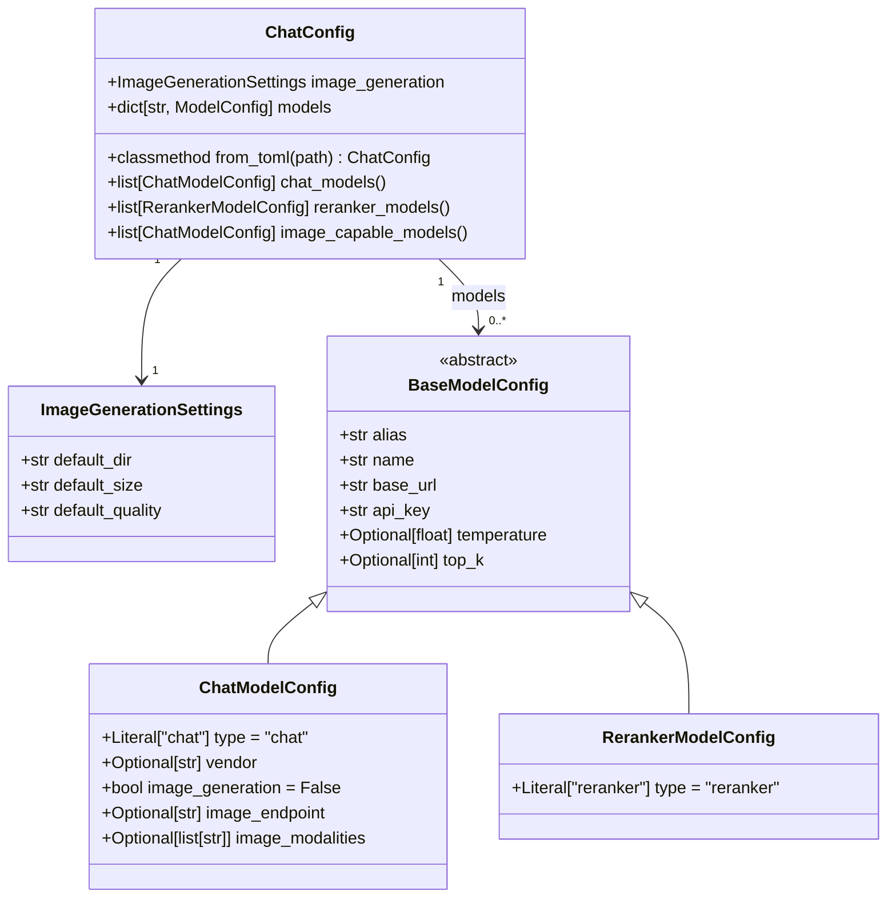

# Chatybot Config Data Model — Design

## Field Analysis

After reviewing all 27 models in `test_config.toml`, the following fields appear across model entries:

### Universal Fields (present on every model)
| Field | Type | Notes |
|-------|------|-------|
| `name` | `str` | The actual API model identifier (e.g. `"gemini-2.5-flash"`) |
| `base_url` | `str` | API endpoint base URL |
| `api_key` | `str` | Environment variable name holding the actual key |

### Common Optional Fields (most models)
| Field | Type | Default | Notes |
|-------|------|---------|-------|
| `temperature` | `float` | `None` | Sampling temperature |
| `top_k` | `int` | `None` | Top-K sampling param |

### Capability / Type Fields
| Field | Type | Default | Notes |
|-------|------|---------|-------|
| `type` | `str` | `"chat"` | `"chat"` or `"reranker"` |
| `vendor` | `str` | `None` | `"mistral"`, `"google"`, `"openai"`, `"openrouter"` |
| `image_generation` | `bool` | `False` | Whether model supports image gen |
| `image_endpoint` | `str` | `None` | Sub-path for image requests (e.g. `"/images/generations"`) |
| `image_modalities` | `list[str]` | `None` | For OpenRouter-style: `["image"]`, `["image","text"]` |

### Top-Level Section
| Field | Type | Notes |
|-------|------|-------|
| `default_dir` | `str` | Default save dir for generated images |
| `default_size` | `str` | e.g. `"1024x1024"` |
| `default_quality` | `str` | e.g. `"standard"` |

---

## Model Type Taxonomy

```
ModelType:
  "chat"      — standard LLM chat completion (the vast majority)
  "reranker"  — re-ranking API (cohere_reranker, remote_jina_rerank)
```

When `type == "reranker"`:
- `temperature`, `top_k`, `image_*` fields are not applicable

When `type == "chat"` and `image_generation == True`:
- `image_endpoint` is required
- `vendor` is required (determines how the image call is structured)
- `image_modalities` may be set for OpenRouter-style requests

---

## Design Decisions

1. **Use Pydantic v2 `BaseModel`** — already in the venv (`pydantic 2.12.5`), gives free validation + schema export.
2. **Discriminated Union** — use `type` literal to split `ChatModelConfig` from `RerankerModelConfig`, enabling strict validation of which fields are required.
3. **`ModelConfig` = Union type** — the `models` dict in `ChatConfig` maps alias → `ModelConfig`.
4. **`api_key` stores env var name, not actual key** — keep this convention, do not change semantics.
5. **`vendor` as `Optional[str]`** — not all models set it; we can later tighten this to a `Literal` enum.
6. **`image_modalities` as `Optional[list[str]]`** — OpenRouter-specific, absent on other vendors.
7. **Alias key** — the TOML key (e.g. `mistral_1`) is the alias/handle used in chatybot; it should be preserved as a field `alias` when loading from dict.

---

## Proposed Class Diagram



---

## Pydantic Implementation Sketch

```python
from __future__ import annotations
from typing import Annotated, Literal, Optional, Union
from pydantic import BaseModel, Field


class ImageGenerationSettings(BaseModel):
    default_dir: str = "~/chatybot_images"
    default_size: str = "1024x1024"
    default_quality: str = "standard"


class BaseModelConfig(BaseModel):
    alias: str = ""          # populated from the TOML key, not the TOML body
    name: str
    base_url: str
    api_key: str
    temperature: Optional[float] = None
    top_k: Optional[int] = None


class ChatModelConfig(BaseModelConfig):
    type: Literal["chat"] = "chat"
    vendor: Optional[str] = None
    image_generation: bool = False
    image_endpoint: Optional[str] = None
    image_modalities: Optional[list[str]] = None


class RerankerModelConfig(BaseModelConfig):
    type: Literal["reranker"] = "reranker"


# Discriminated union on `type` field
ModelConfig = Annotated[
    Union[ChatModelConfig, RerankerModelConfig],
    Field(discriminator="type"),
]


class ChatConfig(BaseModel):
    image_generation: ImageGenerationSettings = Field(
        default_factory=ImageGenerationSettings
    )
    models: dict[str, ModelConfig] = {}

    @classmethod
    def from_toml(cls, path: str) -> "ChatConfig":
        import tomllib
        with open(path, "rb") as f:
            raw = tomllib.load(f)
        # Inject alias from dict key into each model entry
        for alias, model_data in raw.get("models", {}).items():
            model_data["alias"] = alias
        return cls.model_validate(raw)

    def chat_models(self) -> list[ChatModelConfig]:
        return [m for m in self.models.values() if isinstance(m, ChatModelConfig)]

    def reranker_models(self) -> list[RerankerModelConfig]:
        return [m for m in self.models.values() if isinstance(m, RerankerModelConfig)]

    def image_capable_models(self) -> list[ChatModelConfig]:
        return [m for m in self.chat_models() if m.image_generation]
```

---

## Key Notes / Open Questions

> [!NOTE]
> `api_key` is the **name of an environment variable** (e.g. `"MISTRAL_API_KEY"`), not the key itself.
> If we want runtime key resolution, a `resolve_api_key()` method on `BaseModelConfig` could call `os.getenv(self.api_key)`.

> [!WARNING]
> `nvidia_1` has `image_endpoint` set but **not** `image_generation = true`. This may be a config bug — or intentional. Worth clarifying before enforcing a validator that requires both together.

> [!TIP]
> Once validated, `ChatConfig` could be the single source of truth passed to all model-selection UI, alias lookups, and API dispatch logic in `chatybot_app.py`.
