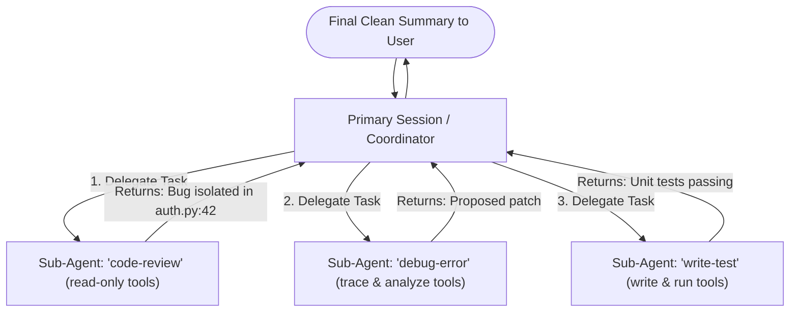

# Chatybot Skills System: Architecture, Scalability Analysis & Evolution

**Date:** September 24, 2026  
**Document:** `skill_concerns.md`  
**Scope:** Design Walkthrough, Scalability Evaluation, Mid-Session Collision Risks, and Sub-Agent Roadmap for Chatybot Skills

---

## 1. Executive Summary & Design Walkthrough

The Chatybot Skills System introduces reusable, trigger-activated domain capabilities into the conversation pipeline. Stored in a dedicated TinyDB database (`~/.local/share/chatybot/skills.json`), skills decouple custom domain guidance and agentic configurations from the general document corpus (`chatydb.py`).

### 1.1 Architecture & Components

```
                          ┌────────────────────────────┐
                          │   ~/.local/share/chatybot/ │
                          │         skills.json        │
                          └─────────────┬──────────────┘
                                        │ (TinyDB)
                                        ▼
┌─────────────────┐           ┌──────────────────┐           ┌────────────────────┐
│ User Prompt     │ ────────> │   skillsdb.py    │ ────────> │   chatybot_app.py  │
│ (single turn)   │           │ (cached enabled) │           │ (_inject_skills)   │
└─────────────────┘           └──────────────────┘           └─────────┬──────────┘
                                                                       │
                                              ┌────────────────────────┴────────────────────────┐
                                              ▼                                                 ▼
                                ┌───────────────────────────┐                     ┌───────────────────────────┐
                                │ System Prompt Injection   │                     │ Tool Reconfiguration      │
                                │ (--- Active Skills ---)   │                     │ (_apply_skill_tool_config)│
                                └───────────────────────────┘                     └───────────────────────────┘
```

1. **Storage & Metadata (`skillsdb.py`)**:
   - Each skill stores `name`, `content`, and metadata: `description`, `triggers` (list of strings), `tags`, `enabled` (boolean), `source`, and optional `tool_config`.
   - **In-Memory Cache**: `_skills_cache` caches all enabled skills. Cache is invalidated on any CRUD or enable/disable mutation (`_invalidate_cache()`).
2. **Command Interface (`commands/skills.py`)**:
   - Exposes `/skill` with 13 subcommands: `list`, `show`, `create` (interactive wizard), `edit` ($EDITOR), `delete`, `enable`, `disable`, `search`, `learn` (extract from session history), `apply` (manual single-turn force), `export` (SKILL.md format), `import`, and `restore`.
3. **Execution Pipeline (`chatybot_app.py`)**:
   - Invoked during prompt construction in both `chat_completion` (API models) and `_apple_fm_completion` (on-device Apple Foundation Models).
   - If a skill has `tool_config`, it prompts the user with an interactive diff summary `(Y/n)`.
   - Automatically takes a snapshot of previous tool states (`_save_tool_state_snapshot()`), enabling one-command rollback via `/skill restore`.

---

## 2. Trigger Mechanism & Execution Flow

### 2.1 Scope of the Trigger Scan
- **Only the Current Turn**: The system evaluates **strictly** the user prompt submitted for the active turn (`user_prompt: str`).
- **No History Contamination**: Historical conversation turns, previous model completions, and attached documents already in context are **not** scanned by the trigger engine.

### 2.2 Trigger Algorithm (Current Implementation)
```python
def get_matching_skills(user_prompt: str) -> list[dict]:
    prompt_lower = user_prompt.lower()
    all_skills = _get_enabled_skills()
    matched = []
    for skill in all_skills:
        triggers = skill.get("metadata", {}).get("triggers", [])
        for trigger in triggers:
            if trigger.lower() in prompt_lower:
                matched.append(skill)
                break
    return matched
```

---

## 3. Scalability Concerns & Five Alternative Options

### 3.1 Limitations of Naive Substring Matching
As the skill database scales beyond a handful of default skills to hundreds or thousands of skills, raw substring checking (`trigger.lower() in prompt_lower`) presents three core failure modes:
1. **Computational Inefficiency**: $O(N_{\text{skills}} \times M_{\text{triggers}} \times L_{\text{prompt}})$ evaluation on every single user prompt.
2. **False Positives / Substring Hijacking**: Short triggers match common conversational vocabulary (e.g., trigger `"log"` matches `"logging"`, `"biology"`, or `"catalog"`).
3. **Unranked Collisions**: When 4 or 5 skills match overlapping terms, all are injected into the system prompt with zero relevance arbitration.

### 3.2 Five Industry Approaches to Scaling

| Option | Method | Time Complexity | False-Positive Resistance | Dependencies / Trade-offs |
| :--- | :--- | :--- | :--- | :--- |
| **1. Token-Set Inverted Index** | Word boundary tokenization (`\b\w+\b`) mapped to skill ID sets | $O(\text{words in prompt})$ | High (enforces discrete word matching) | Zero dependencies. Uses native Python sets. |
| **2. Aho-Corasick Automaton** | Finite state machine Trie built from all trigger patterns | $O(L_{\text{prompt}} + K_{\text{matches}})$ | High (with boundary validation checkpoints) | Nanosecond speed; requires `pyahocorasick` or a lightweight 60-line Trie. |
| **3. BM25 / TF-IDF Ranked Scoring** | Statistical term weighting across triggers, name, and description | Sub-millisecond | Very High (requires relevance threshold cutoff, e.g. $> 0.65$) | Rank-orders multiple matches; selects only top-$K$. |
| **4. Semantic Vector Embeddings** | Cosine similarity between prompt embedding and skill description | 5–20 ms | Highest (paraphrase and synonym resilient) | Requires embedding model / ChromaDB lookup. |
| **5. Two-Stage Hybrid (Trie + /decide Gate)** | Fast Trie filter to pick 0–3 candidates, then `/decide` model gate | Fast ($O(1)$ fast path) | Maximum Precision | Leverages Chatybot's built-in structured decision engine. |

---

## 4. Mid-Session Skill Collisions: Best Practice Analysis

### 4.1 The Problem: Stateless Mid-Session Swapping
Because skills are currently evaluated turn-by-turn without session locks, a user already engaged in a `code-review` workflow who types *"Now write tests for this"* in Turn 2 causes the system to:
1. Trigger `write-test`.
2. Swap the persona in the system prompt while retaining the prior read-only conversation turns.
3. Attempt to reconfigure tools from read-only mode to write-enabled mode mid-flight.

In the AI agent industry, **uncontrolled, mid-session skill switching is considered an anti-pattern** because it causes:
- **Instruction Contradiction**: Models struggle when early history contains rules from Persona A while the active system prompt enforces Persona B.
- **Tool Drift**: Users lose visibility over what capabilities are currently enabled, safe, or disabled.
- **Accidental Hijacking**: Casual conversation words unintentionally switch modes.

### 4.2 Industry Best Practices
1. **Modal / Sticky Sessions (State Machine Pattern)**:
   - When a skill with agentic behavior or tools is activated, the session enters an explicit `active_skill` lock.
   - Subsequent user turns stay routed to this skill until the user explicitly exits (`/skill exit`) or uses manual overrides (`/skill apply <other>`).
2. **Router / Intent Triage Confirmation**:
   - If a significant intent shift is detected during an active workflow, the orchestrator asks:
     > *"You are currently in a code-review session. Would you like to complete this task, or switch to write-test in a fresh session?"*
3. **Sub-Agent Isolation (The Hierarchical Pattern)**:
   - Complex skills run in isolated child contexts, keeping the main session completely clean.

---

## 5. Architectural Roadmap: Sub-Agents & Skill-Calling-Skill

### 5.1 Why Sub-Agents Are Essential for Composable Skills
A single conversational session context cannot reliably execute workflows where **Skill A calls Skill B**.

If `code-review` (read-only) needs to call `debug-error` (trace-focused) and then `write-test` (write-enabled), nesting these within one linear chat history leads to context overflow, token degradation, and tool permission conflicts.



### 5.2 Sub-Agent Execution Contract
In an agentic sub-agent model:
1. **Context Isolation**: Each sub-agent runs with a fresh context window containing only its specialized prompt, its assigned task, and its own execution trace.
2. **Granular Tool Sandboxing**: Sub-agents inherit strictly the toolset defined in their skill's `tool_config`, preventing permission leaks to parent sessions.
3. **Structured Handoff**: Sub-agents do not hold conversational banter; they execute their loop and return structured artifacts (diffs, JSON payloads, or summary reports) back to the calling agent.
4. **ChatDSL Composability**: ChatDSL scripts can invoke sub-agents deterministically:
   ```chatdsl
   # Future ChatDSL sub-agent orchestration
   /run_subagent skill="code-review" target="src/auth.py" -> ${REVIEW_OUTPUT}
   if ${REVIEW_OUTPUT} != "CLEAN" then /run_subagent skill="write-test" target="tests/test_auth.py"
   ```

---

## 6. Actionable Implementation Phasing for Chatybot

| Phase | Milestone | Priority | Effort |
| :--- | :--- | :--- | :--- |
| **Phase 1 (Completed)** | TinyDB skills database, `/skill` command suite, default skills, tool confirmation diffs, SKILL.md export/import, tests. | Done | Complete |
| **Phase 2 (Immediate Guardrails)** | Implement **Option 1 (Token-Set / Inverted Index)** to eliminate false substring triggers; add `app.active_skill` **sticky session lock** to prevent mid-session trigger hijacking. | High | 1–2 days |
| **Phase 3 (Triage & Ranking)** | Add BM25 or `/decide` disambiguation when multiple skills trigger simultaneously. | Medium | 2–3 days |
| **Phase 4 (Sub-Agent Engine)** | Implement `call_subagent(skill_name, task)` allowing skills to spawn ephemeral, sandboxed Chatybot child instances that return structured results. | Strategic | 1–2 weeks |
